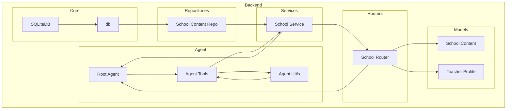

    

    <b>Automatic Architecture Diagrams from Code</b> 
    <a href="https://github.com/swark-io/swark">GitHub</a> • <a href="https://swark.io">Website</a> • <a href="mailto:contact@swark.io">Contact Us</a>

## Usage Instructions

1. **Render the Diagram**: Use the links below to open it in Mermaid Live Editor, or install the [Mermaid Support](https://marketplace.visualstudio.com/items?itemName=bierner.markdown-mermaid) extension.
2. **Recommended Model**: If available for you, use `claude-3.5-sonnet` [language model](vscode://settings/swark.languageModel). It can process more files and generates better diagrams.
3. **Iterate for Best Results**: Language models are non-deterministic. Generate the diagram multiple times and choose the best result.

## Generated Content
**Model**: GPT-4o - [Change Model](vscode://settings/swark.languageModel)  
**Mermaid Live Editor**: [View](https://mermaid.live/view#pako:eNqNVMtugzAQ_BXkc_IDHCo1ybGV2pCeSg8OLGAVvMjYlaoo_97FNm9S4dPu7Hj24YUbSzAFFrJY5orXRXA5xTKg05irAw48-QaZOnQSOaKCAW5P9P4iNJwOnzHrzJh9TTk2ml4n-Lp-BOpHJNDMciQFYuljbSLrd-QNsmeosREalViXPqLUIHVLG-Q9aC9vyPFKQy3_U18oL-Z0AZ4UoN4UZqJsG_VA4JEtnaLRoFbLcKGhCudv0HzO22InimdEbWGSa23PWTREeRqi2KjzFpwPLUYc663XZA1ndpsW7PdPtF0O9O7iRf2VOTwid4skF8s2IvlxPeD0AxkT3JVN8Ul5DzjT9XCkXtcx7IRlP3oLupHOwJXGLW8sw3asAlVxkdLP4hYzXUBFOxgG9DFDxk1JD34nkqlTTq8hOK1LxUKtDOwYNxqjX5l0vkKTFyzMeNnA_Q82C2O4) | [Edit](https://mermaid.live/edit#pako:eNqNVMtugzAQ_BXkc_IDHCo1ybGV2pCeSg8OLGAVvMjYlaoo_97FNm9S4dPu7Hj24YUbSzAFFrJY5orXRXA5xTKg05irAw48-QaZOnQSOaKCAW5P9P4iNJwOnzHrzJh9TTk2ml4n-Lp-BOpHJNDMciQFYuljbSLrd-QNsmeosREalViXPqLUIHVLG-Q9aC9vyPFKQy3_U18oL-Z0AZ4UoN4UZqJsG_VA4JEtnaLRoFbLcKGhCudv0HzO22InimdEbWGSa23PWTREeRqi2KjzFpwPLUYc663XZA1ndpsW7PdPtF0O9O7iRf2VOTwid4skF8s2IvlxPeD0AxkT3JVN8Ul5DzjT9XCkXtcx7IRlP3oLupHOwJXGLW8sw3asAlVxkdLP4hYzXUBFOxgG9DFDxk1JD34nkqlTTq8hOK1LxUKtDOwYNxqjX5l0vkKTFyzMeNnA_Q82C2O4)

