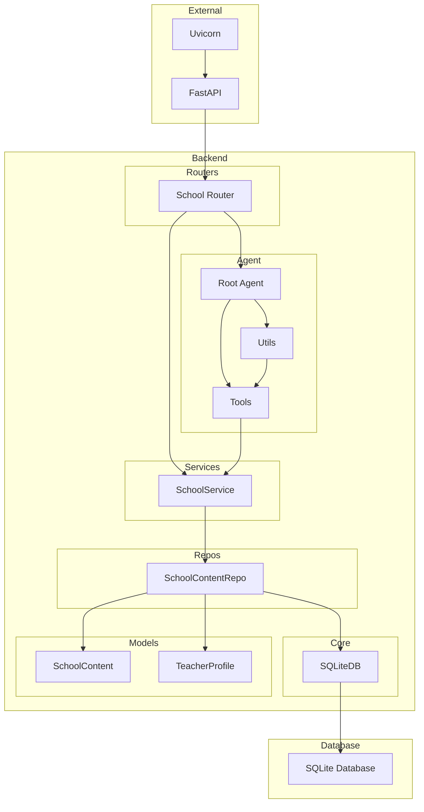

    

    <b>Automatic Architecture Diagrams from Code</b> 
    <a href="https://github.com/swark-io/swark">GitHub</a> • <a href="https://swark.io">Website</a> • <a href="mailto:contact@swark.io">Contact Us</a>

## Usage Instructions

1. **Render the Diagram**: Use the links below to open it in Mermaid Live Editor, or install the [Mermaid Support](https://marketplace.visualstudio.com/items?itemName=bierner.markdown-mermaid) extension.
2. **Recommended Model**: If available for you, use `claude-3.5-sonnet` [language model](vscode://settings/swark.languageModel). It can process more files and generates better diagrams.
3. **Iterate for Best Results**: Language models are non-deterministic. Generate the diagram multiple times and choose the best result.

## Generated Content
**Model**: GPT-4o - [Change Model](vscode://settings/swark.languageModel)  
**Mermaid Live Editor**: [View](https://mermaid.live/view#pako:eNqNVMtugzAQ_BXkc_IDHCrl0UqVWinN41R6cGATUMFGxq5aRfn3-oWxiRPhC-udYbzsjrmgnBaAUpSRM8NtmezXGUnk6sTRJJY4_wZSmGyArCiDIa3W7uOt4rBefmaoDzP0NXDiOu-ygrobKeUlpfWKEg6EKzl_H2iqtQecl8A2jJ6qGiQ9TEyoYQstfVSCwsdlqNwE6R2wnyqHqLrFnLLdTymYCg4sKmogp2mpEzQXZ9XcQHFLKddpKadiy7kZgDynU31Xzxv0wCuN6me8Dh2MnPf8K8smuB7oL7jji82rlLJRIHaQraOMqINM5NCY-hpzfMSd52BjWefdgRGRsecn8_lT0HWD2vM12ldKxgPy3u3HTm6c4ZF815GoQQ25v3jEv5EedKcSN2mDu60GzVwjgBkpcR6491GaN5a68wHBVX9AHF1ygmaoAdbgqpD_s0uGeAmNHF6aZKiAExa19O1VkkRbYNmTCksjNCjlTMAMYcHp7o_k_Z5RcS5ResJ1B9d_ZomZDw) | [Edit](https://mermaid.live/edit#pako:eNqNVMtugzAQ_BXkc_IDHCrl0UqVWinN41R6cGATUMFGxq5aRfn3-oWxiRPhC-udYbzsjrmgnBaAUpSRM8NtmezXGUnk6sTRJJY4_wZSmGyArCiDIa3W7uOt4rBefmaoDzP0NXDiOu-ygrobKeUlpfWKEg6EKzl_H2iqtQecl8A2jJ6qGiQ9TEyoYQstfVSCwsdlqNwE6R2wnyqHqLrFnLLdTymYCg4sKmogp2mpEzQXZ9XcQHFLKddpKadiy7kZgDynU31Xzxv0wCuN6me8Dh2MnPf8K8smuB7oL7jji82rlLJRIHaQraOMqINM5NCY-hpzfMSd52BjWefdgRGRsecn8_lT0HWD2vM12ldKxgPy3u3HTm6c4ZF815GoQQ25v3jEv5EedKcSN2mDu60GzVwjgBkpcR6491GaN5a68wHBVX9AHF1ygmaoAdbgqpD_s0uGeAmNHF6aZKiAExa19O1VkkRbYNmTCksjNCjlTMAMYcHp7o_k_Z5RcS5ResJ1B9d_ZomZDw)

