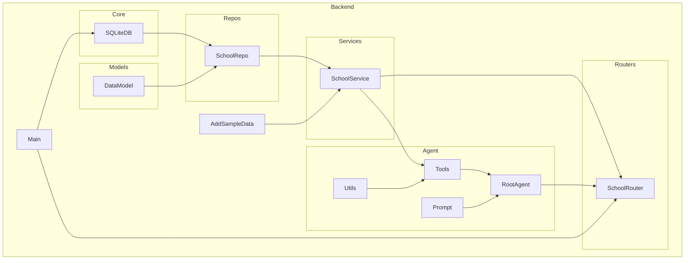

    

    <b>Automatic Architecture Diagrams from Code</b> 
    <a href="https://github.com/swark-io/swark">GitHub</a> • <a href="https://swark.io">Website</a> • <a href="mailto:contact@swark.io">Contact Us</a>

## Usage Instructions

1. **Render the Diagram**: Use the links below to open it in Mermaid Live Editor, or install the [Mermaid Support](https://marketplace.visualstudio.com/items?itemName=bierner.markdown-mermaid) extension.
2. **Recommended Model**: If available for you, use `claude-3.5-sonnet` [language model](vscode://settings/swark.languageModel). It can process more files and generates better diagrams.
3. **Iterate for Best Results**: Language models are non-deterministic. Generate the diagram multiple times and choose the best result.

## Generated Content
**Model**: GPT-4o - [Change Model](vscode://settings/swark.languageModel)  
**Mermaid Live Editor**: [View](https://mermaid.live/view#pako:eNqFU8FuwyAM_ZXI5_YHcpjULsdV2pruxsULboKWQERg0lT130dgbUJKFU74PT_bPOACleIEOTBZa-yb7FQwmbk12K8A7LH6JskDGjGvStMEj6v8eBOGiv2EppUH17MdYm2BBj2-Jj5SrxbasmqUakdiTVyS_hEVJfX_3Gp_ZQ3p9ASeWiuwq0maWH5UyiTgTyOWNp1cmwX0rlXXmyddd5yX2PUtjf5O8AGFDJHPDtvb9WXb7cuDp_f7SbJTPKMjQyNoXmPm2WPO7Lh-68GFW96lZXYwJZV-D58METn27DSjf4GLnvwER2VhAx3pDgV3P-3CwDTUEYM8Y8DpjLY1DK4uyfYcXTGB7qF0kBttaQNojSp_ZXWLtbJ1A_kZ24GufzXsHRo) | [Edit](https://mermaid.live/edit#pako:eNqFU8FuwyAM_ZXI5_YHcpjULsdV2pruxsULboKWQERg0lT130dgbUJKFU74PT_bPOACleIEOTBZa-yb7FQwmbk12K8A7LH6JskDGjGvStMEj6v8eBOGiv2EppUH17MdYm2BBj2-Jj5SrxbasmqUakdiTVyS_hEVJfX_3Gp_ZQ3p9ASeWiuwq0maWH5UyiTgTyOWNp1cmwX0rlXXmyddd5yX2PUtjf5O8AGFDJHPDtvb9WXb7cuDp_f7SbJTPKMjQyNoXmPm2WPO7Lh-68GFW96lZXYwJZV-D58METn27DSjf4GLnvwER2VhAx3pDgV3P-3CwDTUEYM8Y8DpjLY1DK4uyfYcXTGB7qF0kBttaQNojSp_ZXWLtbJ1A_kZ24GufzXsHRo)

