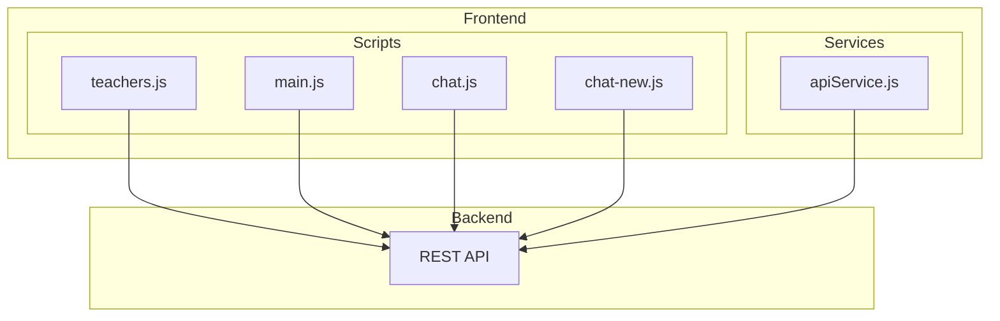

    

    <b>Automatic Architecture Diagrams from Code</b> 
    <a href="https://github.com/swark-io/swark">GitHub</a> • <a href="https://swark.io">Website</a> • <a href="mailto:contact@swark.io">Contact Us</a>

## Usage Instructions

1. **Render the Diagram**: Use the links below to open it in Mermaid Live Editor, or install the [Mermaid Support](https://marketplace.visualstudio.com/items?itemName=bierner.markdown-mermaid) extension.
2. **Recommended Model**: If available for you, use `claude-3.5-sonnet` [language model](vscode://settings/swark.languageModel). It can process more files and generates better diagrams.
3. **Iterate for Best Results**: Language models are non-deterministic. Generate the diagram multiple times and choose the best result.

## Generated Content
**Model**: GPT-4o - [Change Model](vscode://settings/swark.languageModel)  
**Mermaid Live Editor**: [View](https://mermaid.live/view#pako:eNp1UU1PwzAM_SuVzys_oAekwUACCTStvS07mMRbA2ta5YMJTfvvuEuhZGW52H7vxbFfjiBbRVCAMDuLXZ1VC2EyPi68ReDRtsaTURFOqFJa3Xk3Mv2pCGVN1j2Xaz-kN-9uk4peUBsWNBym5H2NnknJ4X_ylQ4Dnxs6pJork5L91JIuRp13eiC4Hf4WVxqekwtz7lB-JC_Ol0_r1UNZ9clmcm_0Jsvz214T8WhHikUXpth5-RT-u8fIwAwasmyx4u89CvA1NSSgyAQo2mLYewEnFoVOoaeFRl6pgcLbQDPA4Nvyy8if2rZhV0Oxxb2j0zemfaju) | [Edit](https://mermaid.live/edit#pako:eNp1UU1PwzAM_SuVzys_oAekwUACCTStvS07mMRbA2ta5YMJTfvvuEuhZGW52H7vxbFfjiBbRVCAMDuLXZ1VC2EyPi68ReDRtsaTURFOqFJa3Xk3Mv2pCGVN1j2Xaz-kN-9uk4peUBsWNBym5H2NnknJ4X_ylQ4Dnxs6pJork5L91JIuRp13eiC4Hf4WVxqekwtz7lB-JC_Ol0_r1UNZ9clmcm_0Jsvz214T8WhHikUXpth5-RT-u8fIwAwasmyx4u89CvA1NSSgyAQo2mLYewEnFoVOoaeFRl6pgcLbQDPA4Nvyy8if2rZhV0Oxxb2j0zemfaju)

