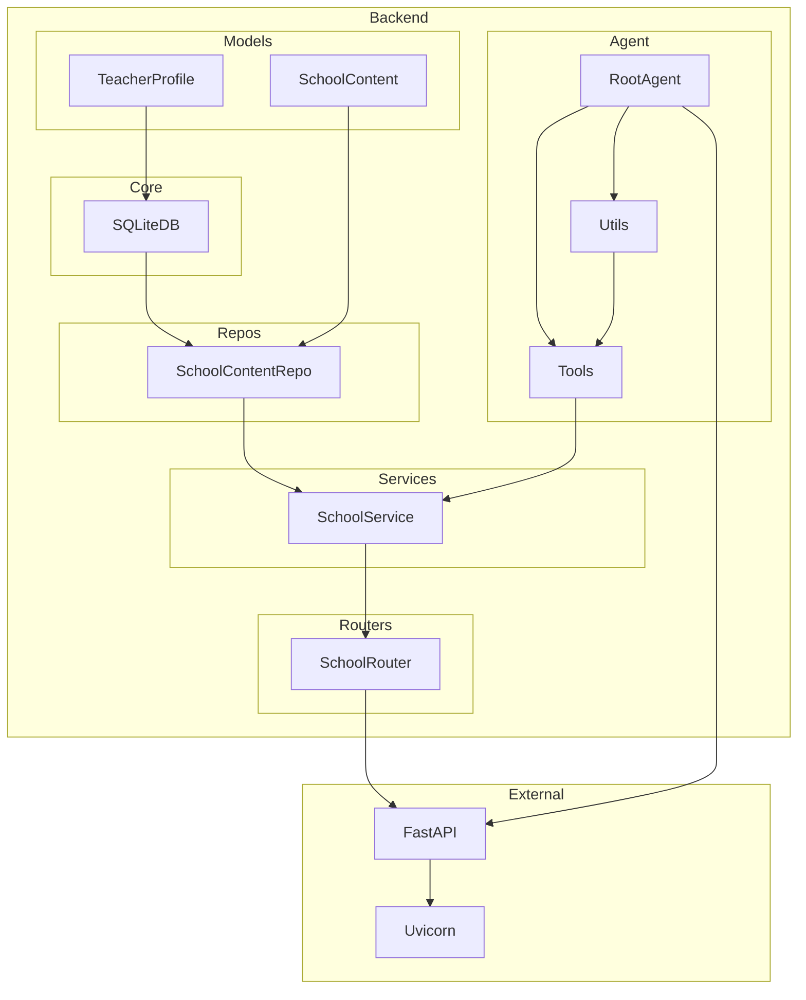

    

    <b>Automatic Architecture Diagrams from Code</b> 
    <a href="https://github.com/swark-io/swark">GitHub</a> • <a href="https://swark.io">Website</a> • <a href="mailto:contact@swark.io">Contact Us</a>

## Usage Instructions

1. **Render the Diagram**: Use the links below to open it in Mermaid Live Editor, or install the [Mermaid Support](https://marketplace.visualstudio.com/items?itemName=bierner.markdown-mermaid) extension.
2. **Recommended Model**: If available for you, use `claude-3.5-sonnet` [language model](vscode://settings/swark.languageModel). It can process more files and generates better diagrams.
3. **Iterate for Best Results**: Language models are non-deterministic. Generate the diagram multiple times and choose the best result.

## Generated Content
**Model**: GPT-4o - [Change Model](vscode://settings/swark.languageModel)  
**Mermaid Live Editor**: [View](https://mermaid.live/view#pako:eNqNVMtuwyAQ_BWLc_IDPlTKo5UqtVIaJ6e6B2pvYqsYIgxVqyj_3gUMfjYyF5ad0Whg1r6STORAYpLys6SXIjpsUx7hqvWna6xp9gU8d90eshES2rZZydtLqWC7fk-JL1Py0XKmdV7RAasHSlkhBNsIroArI9c99zTNOgDNCpA7KU4lA6T3GzM87OEi7lkw-NCG6c2QTkB-lxlMqjdYUG7OcwwLrUBOijooaLrjDMnV2bxtT3AvhLJtVAv16PmPqmQ1Muw-Dgc9GNTu0zZsMZi7xx90zSlr6U-0VqvdM0o1VU_siA8nJDc2XBXQjrqfymi5fBgH3HCG7Q7Z58NHEXZIzYPzYSKW4q3zzo0s4F3zCRf37PZH3TH9t9doheQs6nKYAFx8PGT2370t775UuCVZkApkRcsc_zHXlKgCKhzvOEpJDieqGU7TDUn6klO0XFIMvyKxkhoWhGolkl-e-bMU-lyQ-ERZDbc_FQV2eA) | [Edit](https://mermaid.live/edit#pako:eNqNVMtuwyAQ_BWLc_IDPlTKo5UqtVIaJ6e6B2pvYqsYIgxVqyj_3gUMfjYyF5ad0Whg1r6STORAYpLys6SXIjpsUx7hqvWna6xp9gU8d90eshES2rZZydtLqWC7fk-JL1Py0XKmdV7RAasHSlkhBNsIroArI9c99zTNOgDNCpA7KU4lA6T3GzM87OEi7lkw-NCG6c2QTkB-lxlMqjdYUG7OcwwLrUBOijooaLrjDMnV2bxtT3AvhLJtVAv16PmPqmQ1Muw-Dgc9GNTu0zZsMZi7xx90zSlr6U-0VqvdM0o1VU_siA8nJDc2XBXQjrqfymi5fBgH3HCG7Q7Z58NHEXZIzYPzYSKW4q3zzo0s4F3zCRf37PZH3TH9t9doheQs6nKYAFx8PGT2370t775UuCVZkApkRcsc_zHXlKgCKhzvOEpJDieqGU7TDUn6klO0XFIMvyKxkhoWhGolkl-e-bMU-lyQ-ERZDbc_FQV2eA)

