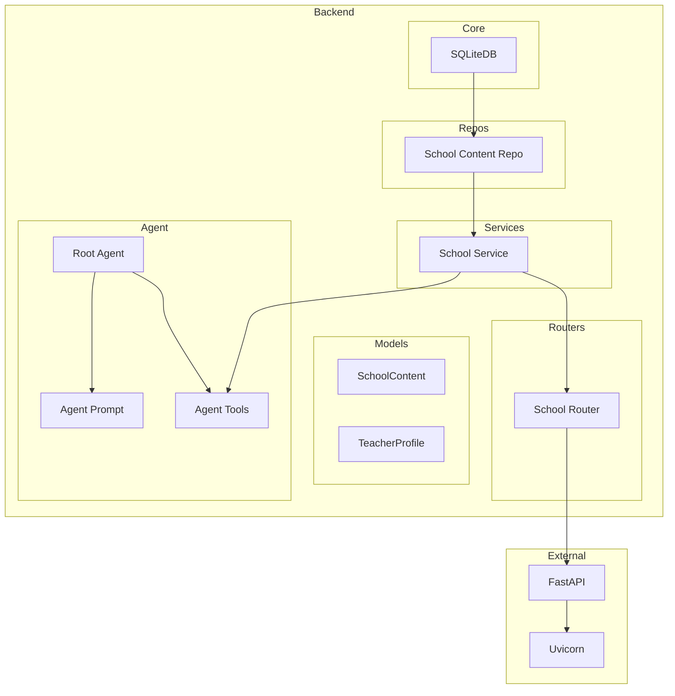

    

    <b>Automatic Architecture Diagrams from Code</b> 
    <a href="https://github.com/swark-io/swark">GitHub</a> • <a href="https://swark.io">Website</a> • <a href="mailto:contact@swark.io">Contact Us</a>

## Usage Instructions

1. **Render the Diagram**: Use the links below to open it in Mermaid Live Editor, or install the [Mermaid Support](https://marketplace.visualstudio.com/items?itemName=bierner.markdown-mermaid) extension.
2. **Recommended Model**: If available for you, use `claude-3.5-sonnet` [language model](vscode://settings/swark.languageModel). It can process more files and generates better diagrams.
3. **Iterate for Best Results**: Language models are non-deterministic. Generate the diagram multiple times and choose the best result.

## Generated Content
**Model**: GPT-4o - [Change Model](vscode://settings/swark.languageModel)  
**Mermaid Live Editor**: [View](https://mermaid.live/view#pako:eNqNU8tug0AM_BW05-QHOFTKo5UqtVKapKfSwxacgAJrtOxWraL8e80-gCVUYk-2ZzLYY-fKUsyAxSwRZ8nrPDpuExHRa_SXLax5egGR2WqAbFBCX27f4e2lULBdfyTMhwn77DnTOq_UQdmMlNIcsdygUCBUKzfMA832HYGnOcidxFNRAtHDwoweDiC_ixQmu3BY14Unz5DdQ42Tmi3QC7q5DH2OKmoFclrXQL2yzWdors6tsYHiHlGZMsm1sePcmU_faYhiUJvdcWgRVa06kk2nuzLB6AYff2gIwcue_sQbtdo9k6KLArF3Wg9KQaiLOnSg7i80Wi4fBltxYJcPYL93cXcbQw3r-D8ca48YL8xgfhIRmD_-WQg4J8XAE1P3cwu2YBXIihcZ_cmvCVM5VHS5cZSwDE5cl7SGG5F0nXFyo-DkeMViJTUsGNcKD78i9blEfc5ZfOJlA7c_S11LXg) | [Edit](https://mermaid.live/edit#pako:eNqNU8tug0AM_BW05-QHOFTKo5UqtVKapKfSwxacgAJrtOxWraL8e80-gCVUYk-2ZzLYY-fKUsyAxSwRZ8nrPDpuExHRa_SXLax5egGR2WqAbFBCX27f4e2lULBdfyTMhwn77DnTOq_UQdmMlNIcsdygUCBUKzfMA832HYGnOcidxFNRAtHDwoweDiC_ixQmu3BY14Unz5DdQ42Tmi3QC7q5DH2OKmoFclrXQL2yzWdors6tsYHiHlGZMsm1sePcmU_faYhiUJvdcWgRVa06kk2nuzLB6AYff2gIwcue_sQbtdo9k6KLArF3Wg9KQaiLOnSg7i80Wi4fBltxYJcPYL93cXcbQw3r-D8ca48YL8xgfhIRmD_-WQg4J8XAE1P3cwu2YBXIihcZ_cmvCVM5VHS5cZSwDE5cl7SGG5F0nXFyo-DkeMViJTUsGNcKD78i9blEfc5ZfOJlA7c_S11LXg)

