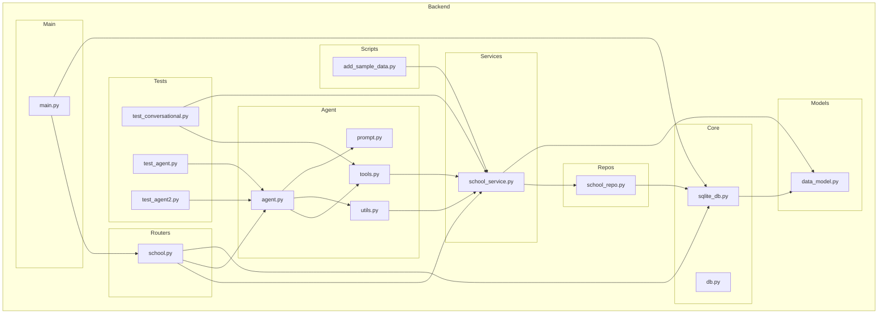

    

    <b>Automatic Architecture Diagrams from Code</b> 
    <a href="https://github.com/swark-io/swark">GitHub</a> • <a href="https://swark.io">Website</a> • <a href="mailto:contact@swark.io">Contact Us</a>

## Usage Instructions

1. **Render the Diagram**: Use the links below to open it in Mermaid Live Editor, or install the [Mermaid Support](https://marketplace.visualstudio.com/items?itemName=bierner.markdown-mermaid) extension.
2. **Recommended Model**: If available for you, use `claude-3.5-sonnet` [language model](vscode://settings/swark.languageModel). It can process more files and generates better diagrams.
3. **Iterate for Best Results**: Language models are non-deterministic. Generate the diagram multiple times and choose the best result.

## Generated Content
**Model**: GPT-4o - [Change Model](vscode://settings/swark.languageModel)  
**Mermaid Live Editor**: [View](https://mermaid.live/view#pako:eNqNVE2PgjAQ_SukiTfdBPDkYRMWr16kt7IhFUYhC7TbFhNj_O87fLi7rZrQA-l7M32deQNcSS4KIBuStifFZenRbdp6uHR3GIkPnn9BW4ysFYlO0Jo_vl-Rz3jPvsnLpxMJmBGi1k8iIetM9TSyZlKJRjpyz6tJQJ2rHLQtkfhM5yVenOkxPkdqLzoDylHa35XmKMRCgX08xuPfdWUgKw6PncYBc-nnwjucVu1UtvNZwQ3Pmj42qz-Qwu0OqV-rFII5OhS0cXSozwyyWS7aM1rITSVaXj82TIMx78XbQsN_4WDW-HNVSbeaBF3nRZFp3sganUeXZpnMq9axGBmfNfh8cX7YjNvFAt2sh851WcmppMj3Vqt3_AxsGNpwPcFggIk_wdCCyZg8jMxidhPc-1b-BCMbxhOMnbO9qpVA7cqpLU4DS5yGFkxiO3vwcaz-genvI0vSgEKfC_wlXVNiSmggJRsvJQUceVeblNwwqZM4S9hWHAfWkI1RHSwJ74xILm1-x0p0p5JsjrzWcPsB-F1VjQ) | [Edit](https://mermaid.live/edit#pako:eNqNVE2PgjAQ_SukiTfdBPDkYRMWr16kt7IhFUYhC7TbFhNj_O87fLi7rZrQA-l7M32deQNcSS4KIBuStifFZenRbdp6uHR3GIkPnn9BW4ysFYlO0Jo_vl-Rz3jPvsnLpxMJmBGi1k8iIetM9TSyZlKJRjpyz6tJQJ2rHLQtkfhM5yVenOkxPkdqLzoDylHa35XmKMRCgX08xuPfdWUgKw6PncYBc-nnwjucVu1UtvNZwQ3Pmj42qz-Qwu0OqV-rFII5OhS0cXSozwyyWS7aM1rITSVaXj82TIMx78XbQsN_4WDW-HNVSbeaBF3nRZFp3sganUeXZpnMq9axGBmfNfh8cX7YjNvFAt2sh851WcmppMj3Vqt3_AxsGNpwPcFggIk_wdCCyZg8jMxidhPc-1b-BCMbxhOMnbO9qpVA7cqpLU4DS5yGFkxiO3vwcaz-genvI0vSgEKfC_wlXVNiSmggJRsvJQUceVeblNwwqZM4S9hWHAfWkI1RHSwJ74xILm1-x0p0p5JsjrzWcPsB-F1VjQ)

