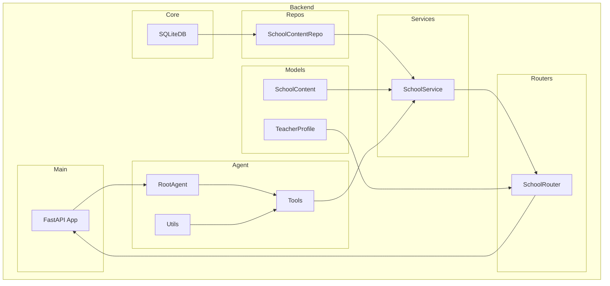

    

    <b>Automatic Architecture Diagrams from Code</b> 
    <a href="https://github.com/swark-io/swark">GitHub</a> • <a href="https://swark.io">Website</a> • <a href="mailto:contact@swark.io">Contact Us</a>

## Usage Instructions

1. **Render the Diagram**: Use the links below to open it in Mermaid Live Editor, or install the [Mermaid Support](https://marketplace.visualstudio.com/items?itemName=bierner.markdown-mermaid) extension.
2. **Recommended Model**: If available for you, use `claude-3.5-sonnet` [language model](vscode://settings/swark.languageModel). It can process more files and generates better diagrams.
3. **Iterate for Best Results**: Language models are non-deterministic. Generate the diagram multiple times and choose the best result.

## Generated Content
**Model**: GPT-4o - [Change Model](vscode://settings/swark.languageModel)  
**Mermaid Live Editor**: [View](https://mermaid.live/view#pako:eNqNVMtqwzAQ_BWjc_IDPhSchEKhhTROT3UPqry2RWzJyFKhhPx7V_L7VayL9jEeDTuL74TJGIhPIpEqWmbe9RQJD09lvuvCgbIbiLiujjpHqaAv2xO-v3INp8NnRNowIl89ZpnnDRXk1YSJZVLmRyk0CG3phvmI054rUJaBOiuZ8BwQPi5s0HCBUv4nwfanMmxtA3UI6oczWGRveh1zk28RLI0GtUhatzrOOt1AGaR2tiPCi5TalZGti2fj_9A8rxDh7rk5qMF23b1lHSgXY4ZnWung_BKUJdI0iYfZMpkL6rBdQm-_f5r72WCm5QG4tUPMHBuAmvmKqQEO0ktfeG3tpfH2rjzV2eH69XBFN-81amfR9ItepOv0RguyIwWogvIYfxH3iOgMCtxO34tIDAk1OS7DA0GmjCkOmlO0sCC-VgZ2hBotw1_B2lxJk2bET2heweMPtttgkQ) | [Edit](https://mermaid.live/edit#pako:eNqNVMtqwzAQ_BWjc_IDPhSchEKhhTROT3UPqry2RWzJyFKhhPx7V_L7VayL9jEeDTuL74TJGIhPIpEqWmbe9RQJD09lvuvCgbIbiLiujjpHqaAv2xO-v3INp8NnRNowIl89ZpnnDRXk1YSJZVLmRyk0CG3phvmI054rUJaBOiuZ8BwQPi5s0HCBUv4nwfanMmxtA3UI6oczWGRveh1zk28RLI0GtUhatzrOOt1AGaR2tiPCi5TalZGti2fj_9A8rxDh7rk5qMF23b1lHSgXY4ZnWung_BKUJdI0iYfZMpkL6rBdQm-_f5r72WCm5QG4tUPMHBuAmvmKqQEO0ktfeG3tpfH2rjzV2eH69XBFN-81amfR9ItepOv0RguyIwWogvIYfxH3iOgMCtxO34tIDAk1OS7DA0GmjCkOmlO0sCC-VgZ2hBotw1_B2lxJk2bET2heweMPtttgkQ)

