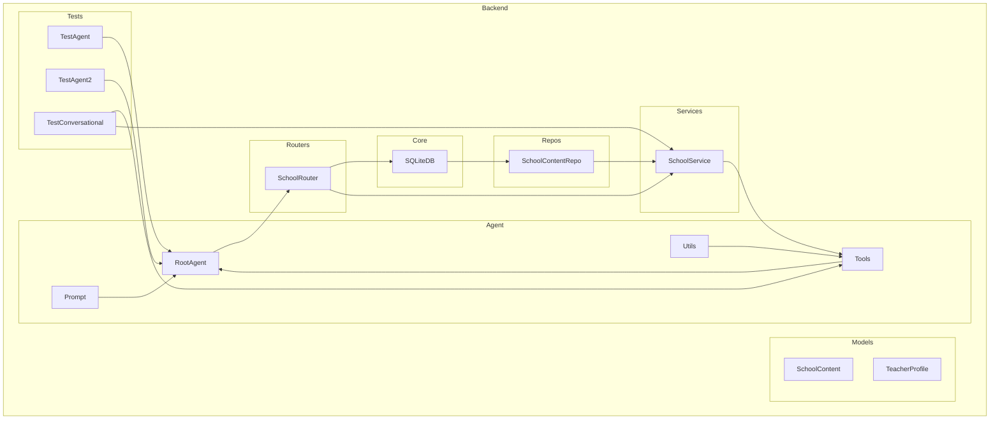

    

    <b>Automatic Architecture Diagrams from Code</b> 
    <a href="https://github.com/swark-io/swark">GitHub</a> • <a href="https://swark.io">Website</a> • <a href="mailto:contact@swark.io">Contact Us</a>

## Usage Instructions

1. **Render the Diagram**: Use the links below to open it in Mermaid Live Editor, or install the [Mermaid Support](https://marketplace.visualstudio.com/items?itemName=bierner.markdown-mermaid) extension.
2. **Recommended Model**: If available for you, use `claude-3.5-sonnet` [language model](vscode://settings/swark.languageModel). It can process more files and generates better diagrams.
3. **Iterate for Best Results**: Language models are non-deterministic. Generate the diagram multiple times and choose the best result.

## Generated Content
**Model**: GPT-4o - [Change Model](vscode://settings/swark.languageModel)  
**Mermaid Live Editor**: [View](https://mermaid.live/view#pako:eNqNVD1vgzAQ_SvIc7JkZKjUJGMrtUk6lQ4uHAHF2MjYqaoo_71nDAaMU-GF-3h6vrt35kZSkQGJScJzJn7SgkoVnfYJj_A0-vssaV1EW5pegGc2OsnshIQhbM7x_aVUsN9-JqQ3E_I1YMI8r1gFazymtBCC7QRXwJWhG_sTTnNOQNMC5JsUeckA4dPAghoOUIv_SjB5vwwTW0B9BHktUwiydznH3PkLWJ_PZhATyoMQqg0jnbPns8JrGjMi851lP1TZZtvvLIvzrGpDb40lcxVagQz2blOudesuoDxBoxpf_8Z17uzAlnSZzRi2CeJQ4ivWTVUpOGUdfhoMl9oa1uyfQLReP823qcP44RG4XwY-25cWZAXkTtM2OOjOnZw-2ooXgjt3VEWnC_eFs5D-lT9Iz_twcw_dP4jyKDuVYDaHMMIrg6xIBbKiZYb_vltCVAEVPrk4SkgGOdUMV-eOIF1nFJsrKe5dRWIlNawI1Uocf3na-1Loc0HinLIG7n_JYKa7) | [Edit](https://mermaid.live/edit#pako:eNqNVD1vgzAQ_SvIc7JkZKjUJGMrtUk6lQ4uHAHF2MjYqaoo_71nDAaMU-GF-3h6vrt35kZSkQGJScJzJn7SgkoVnfYJj_A0-vssaV1EW5pegGc2OsnshIQhbM7x_aVUsN9-JqQ3E_I1YMI8r1gFazymtBCC7QRXwJWhG_sTTnNOQNMC5JsUeckA4dPAghoOUIv_SjB5vwwTW0B9BHktUwiydznH3PkLWJ_PZhATyoMQqg0jnbPns8JrGjMi851lP1TZZtvvLIvzrGpDb40lcxVagQz2blOudesuoDxBoxpf_8Z17uzAlnSZzRi2CeJQ4ivWTVUpOGUdfhoMl9oa1uyfQLReP823qcP44RG4XwY-25cWZAXkTtM2OOjOnZw-2ooXgjt3VEWnC_eFs5D-lT9Iz_twcw_dP4jyKDuVYDaHMMIrg6xIBbKiZYb_vltCVAEVPrk4SkgGOdUMV-eOIF1nFJsrKe5dRWIlNawI1Uocf3na-1Loc0HinLIG7n_JYKa7)

